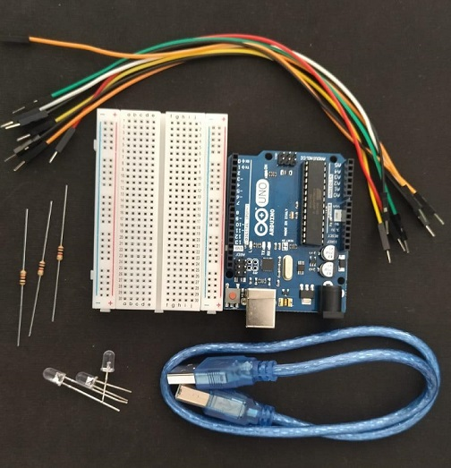

# Desenvolvimento de um Semáforo no Arduino Uno

## Visão geral

É de todo conhecimento geral que o semáforo é apenas um instrumento para controlar o tráfego de veículos tanto para pedestre em grandes cidades urbanas, mas a pergunta é? Como é feita essa estrutura ou tem alguma linguagem de programação por trás, essas e outras perguntas serão respondidas ao decorrer do desenvolvimento.
Para entender melhor sobre o desenvolvimento deste módulo, iniciaremos um projeto simples de um semáforo capaz de acender as luzes de acordo com o tempo dado entre um tráfego de trânsito, contando minutos de cada cor, sinalizando o seu efeito de cada um. Aliás, sobre linguagem de programação, neste caso utilizaremos um software livre para montar, codificar e personalizar com melhorias.
 

Para saber mais informações acesse www.arduino.cc

## Metodologias

Para o desenvolvimento do protótipo houve a necessidade de  apropriar de conhecimentos básicos de eletrônica, pois no desenvolvimento dessa atividade foram necessários alguns conhecimentos sobre programação e lógica de programação, além de conhecimentos de objetos do conhecimento da área da Matemática.

Para obter mais sobre o assunto, abaixe o manual na pasta Docs.

## Objetivos

A princípio o grande desafio deste projeto é a implementação correta dos LEDS com suas respectivas cores, além disso teremos resistores e jumpers no circuito e o uso de uma das linhas inferiores da protoboard, conectando o pino GND (negativo) do Arduino na linha azul da protoboard. Para começarmos a desenvolver o protótipo, precisamos dos seguintes componentes que são eles:

 

Cada um desses componentes é necessário para implementação do semáforo, a duração tempo para construir daria em torno de uma hora para terminar, iremos detalhar cada item que será utilizado em nosso projeto, explorando as funcionalidades de cada componente e explicações relacionadas às peças.

## Matemática do Semáforo

## Considerações Finais

Neste módulo da pesquisa procurou-se estudar sobre as potencialidades da inclusão do semáforo na educação básica. Com o objetivo de conhecimento matemático e da lógica de programação, e a criação e montagem deste protótipo, foram adquiridos alguns materiais, tais como: placas Arduino, leds, entre outros componentes. A princípio tivemos que decifrar o semáforo, sua lógica de funcionamento. Ele é um instrumento de mobilidade e segurança muito importante, serve para controlar o tráfego de veículos, bem como regular o fluxo de pedestres, principalmente em grandes centros urbanos. Nessa atividade exploramos objetos do conhecimento da área de Matemática, como é o caso das funções definidas por sentenças e funções periódicas. Aqui vale destacar que a temática semáforo e mobilidade, além de abordar os objetos do conhecimento da área da Matemática já citados, poderia resultar no desenvolvimento de um projeto integrador envolvendo todas as áreas do conhecimento como inteligência artificial.

 

## Como Contribuir

Para contribuir e deixar a comunidade open source um lugar incrivel para aprender, projetar, criar e inspirar outras pessoas. Basta seguir as instruções logo abaixo:

1. Realize um Fork do projeto
2. Crie um branch com a nova feature (`git checkout -b feature/featureSemaphore`)
3. Realize o Commit (`git commit -m 'Add some featureSemaphore'`)
4. Realize o Push no Branch (`git push origin feature/featureSemaphore`)
5. Abra um Pull Request

 

## Autores

- **[Rafinha](https://github.com/rafalup)** - _Acadêmica do Curso de Ciência da Computação -UFFS_. 
